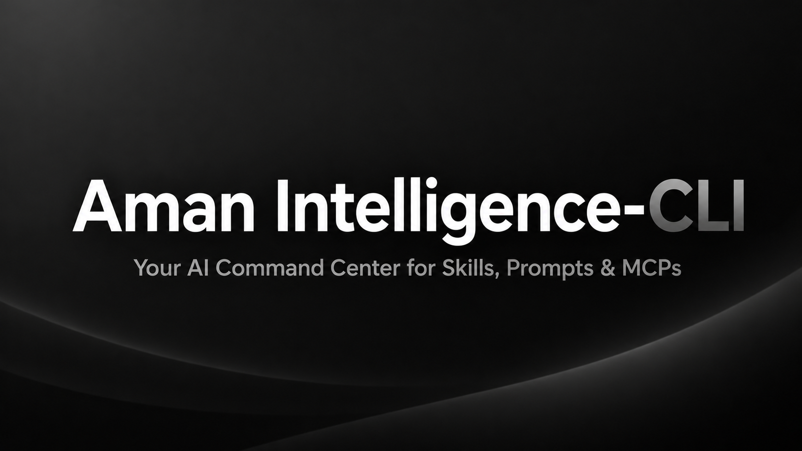

# Aman Intelligence



Aman is the package manager for AI workflow assets.

Most developers have skills, prompts, and MCP configurations scattered across GitHub repositories, local folders, and notes. Aman gives you one place to install, organize, sync, and share them — the same way npm manages packages.

## What Aman manages

| Kind | What it is |
|------|------------|
| **Skills** | Reusable agent instructions (`SKILL.md`) |
| **Prompts** | System and task prompts (`PROMPT.md`) |
| **MCPs** | Model Context Protocol server configs (`mcp.json`) |
| **Packs** | Bundles of assets you can share as `.amanpack` files |
| **Stacks** | Named workflows that combine skills, prompts, and MCPs |

## Quick install

After the package is [published to npm](https://www.npmjs.com/package/aman-cli) as `aman-cli`:

```bash
npx aman-cli
```

Running `npx aman-cli` with no arguments installs Aman globally. To run without installing, pass a subcommand:

```bash
npx aman-cli doctor
```

Then use the CLI from anywhere:

```bash
aman --version
aman init --local
```

**Other install paths:**

```bash
npm install -g aman-cli
aman doctor
```

The CLI ships with **no default assets**. Install skills, prompts, and MCPs from the registry, import, or your own directories.

## Three commands that show the value

```bash
# 1. Set up your environment (local or GitHub-backed)
aman init --local

# 2. Install an asset (registry example — publish or use a known slug@version)
aman install "@your-scope/your-asset@1.0.0" --global

# 3. Verify everything is healthy
aman doctor
```

Or import from a folder, GitHub repository, another AI tool, or an Aman environment:

```bash
aman import                    # interactive wizard (TTY)
aman import cursor --global    # shorthand syntax for Cursor rules/MCPs
aman import antigravity --global # shorthand syntax for Antigravity rules/MCPs
aman import ./my-assets --global
aman import owner/repo --global
```

See [docs/IMPORT-GUIDE.md](./docs/IMPORT-GUIDE.md) for the full import guide covering Claude Code, Cursor, Windsurf, Continue.dev, VS Code, Copilot, Codex, Antigravity, and Aman Environment imports.

## Documentation (GitHub)

| Document | Audience |
|----------|----------|
| [QUICK-START.md](./QUICK-START.md) | New users — zero to first asset in minutes |
| [docs/IMPORT-GUIDE.md](./docs/IMPORT-GUIDE.md) | Import from Claude Code, VS Code, Copilot, Codex, and local folders |
| [docs/ASSET-SPEC.md](./docs/ASSET-SPEC.md) | Publishers — canonical asset format |
| [docs/REGISTRY-SPEC.md](./docs/REGISTRY-SPEC.md) | Contributors — registry contract |
| [docs/LOCKFILE-SPEC.md](./docs/LOCKFILE-SPEC.md) | Developers — reproducible installs |
| [CONTRIBUTING.md](./CONTRIBUTING.md) | Contributors — code, assets, and PRs |
| [SECURITY.md](./SECURITY.md) | Security model and reporting |
| [RELEASE-NOTES.md](./RELEASE-NOTES.md) | Release history |
| [AMAN_CONSTITUTION.md](./AMAN_CONSTITUTION.md) | Permanent architectural principles |
| [PUBLISHING.md](./PUBLISHING.md) | Maintainers — npm pack and publish |

Normative specs: [docs/specs/](./docs/specs/) (`AMAN-ASSET-SPEC-V1.md`, `AMAN-REGISTRY-SPEC-V1.md`, `AMAN-LOCKFILE-SPEC-V1.md`, and related).

## Configuration

### `AMAN_REGISTRY_BACKEND`

| Value | Adapter | Storage |
|-------|---------|---------|
| `local` (default) | Local filesystem | `~/.aman/registry/` |
| `github` | GitHub mirror | `~/.aman/repositories/{repo}/registry/` |

```bash
export AMAN_REGISTRY_BACKEND=github
```

## Requirements

- Node.js 18+
- Git (for import and GitHub sync)
- GitHub CLI (`gh`) optional — for `aman init --github` and `aman sync`

## Contributing

See [CONTRIBUTING.md](./CONTRIBUTING.md).

## License

MIT — see [LICENSE](./LICENSE).
