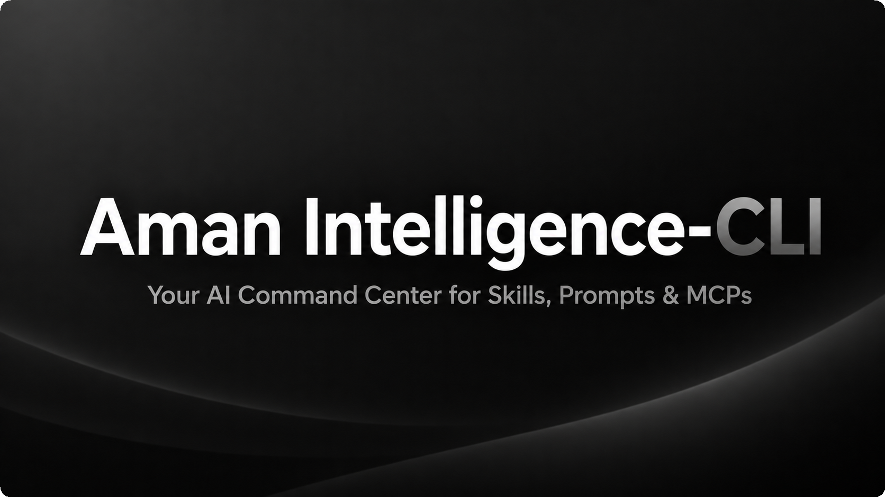

<div align="center">

# Aman CLI

**The Package Manager & Workspace Orchestrator for AI Workflow Assets.**

[](https://www.npmjs.com/package/aman-cli)
[](https://nodejs.org/)
[](https://github.com/amandeavor/Aman-CLI/actions/workflows/ci.yml)
[](LICENSE)
[](https://www.typescriptlang.org/)

<p align="center">
  <a href="#quickstart">Quickstart</a> •
  <a href="#what-aman-manages">Architecture</a> •
  <a href="#cli-commands">Commands</a> •
  <a href="#editor--agent-imports">Imports</a> •
  <a href="#documentation">Documentation</a>
</p>



</div>

---

Most developers have custom **Agent Skills**, **System Prompts**, and **Model Context Protocol (MCP)** server configurations scattered across private folders, Gists, and random repositories. 

`aman` brings package-manager ergonomics to AI workflows: install, lock, sync, and share skills and tool configs across machines and IDEs with reproducible `aman.lock` files.

---

## What Aman Manages

```
                    ┌──────────────────────────────────────────────┐
                    │           Aman Workflow Ecosystem            │
                    └──────────────────────┬───────────────────────┘
                                           │
         ┌──────────────────┬──────────────┴─────┬──────────────────┐
         ▼                  ▼                    ▼                  ▼
  ┌──────────────┐   ┌──────────────┐     ┌──────────────┐   ┌──────────────┐
  │ Agent Skills │   │ Task Prompts │     │ MCP Servers  │   │ Stacks/Packs │
  │  (SKILL.md)  │   │ (PROMPT.md)  │     │  (mcp.json)  │   │  (.amanpack) │
  └──────────────┘   └──────────────┘     └──────────────┘   └──────────────┘
```

| Asset Type | Canonical Format | What It Does |
| :--- | :--- | :--- |
| **Skills** | `skills/<name>/SKILL.md` | Reusable procedural instructions, tools, and workflows for coding agents. |
| **Prompts** | `prompts/<name>/PROMPT.md` | System-level prompt templates with parameter substitution. |
| **MCPs** | `mcps/<name>/mcp.json` | Model Context Protocol servers, transport settings, and environment secrets. |
| **Packs** | `.amanpack` archives | Shareable, compressed bundles combining skills, prompts, and server configs. |
| **Stacks** | Named manifest sets | Pre-configured environment setups combining related skills and tool servers. |

---

## Quickstart

### 1. Run with `npx` (Zero Installation)

```bash
npx aman-cli
```

Or install globally via `npm`:

```bash
npm install -g aman-cli
```

### 2. Initialize your workspace

```bash
# Initialize in current project
aman init --local

# Or initialize global developer profile
aman init --global
```

### 3. Verify environment health

```bash
aman doctor
```

---

## CLI Commands

| Command | Description |
| :--- | :--- |
| `aman init [--local \| --global]` | Initializes an Aman environment directory with `.aman/` configuration and lockfile. |
| `aman install <package>` | Installs an asset package or stack with cryptographic dependency resolution. |
| `aman import [adapter]` | Discovers and imports existing rules and MCPs from Claude Code, Cursor, Windsurf, or Antigravity. |
| `aman doctor` | Performs static pre-flight diagnostics (node version, lockfiles, secret isolation, layout rules). |
| `aman pack <name>` | Compiles an asset directory into a distributable `.amanpack` archive. |
| `aman sync` | Synchronizes active workspace assets with a remote GitHub storage profile. |

---

## Editor & Agent Imports

`aman` can automatically extract and normalize skills and MCP servers from existing IDEs and agent runners:

```bash
# Interactive import wizard
aman import

# Direct imports from configured editors
aman import cursor --global
aman import antigravity --global
aman import ./local-skills-folder --global
aman import owner/repo --global
```

*See [docs/IMPORT-GUIDE.md](./docs/IMPORT-GUIDE.md) for detailed instructions covering Claude Code, Cursor, Windsurf, Continue.dev, Copilot, Codex, and Antigravity.*

---

## Documentation

| Guide | Description |
| :--- | :--- |
| [**Quickstart Guide**](./QUICK-START.md) | Step-by-step walkthrough from initial setup to first installed skill. |
| [**Import Guide**](./docs/IMPORT-GUIDE.md) | Multi-IDE discovery and migration manual. |
| [**Asset Specification**](./docs/ASSET-SPEC.md) | Standard directory layout, metadata schema, and validation rules. |
| [**Registry Specification**](./docs/REGISTRY-SPEC.md) | Package publishing, versioning, and distribution contract. |
| [**Lockfile Specification**](./docs/LOCKFILE-SPEC.md) | Reproducible environment schema for `aman.lock`. |
| [**Aman Constitution**](./AMAN_CONSTITUTION.md) | Core architectural principles and local-first data guarantees. |
| [**Contributing Guide**](./CONTRIBUTING.md) | Local development, test suites, and PR standards. |
| [**Security Policy**](./SECURITY.md) | Secret isolation (`mcp.local.json`) and vulnerability reporting. |
| [**Project Roadmap**](./ROADMAP.md) | Planned capabilities, transports, and registry milestones. |

---

## License

This project is licensed under the [MIT License](LICENSE).
